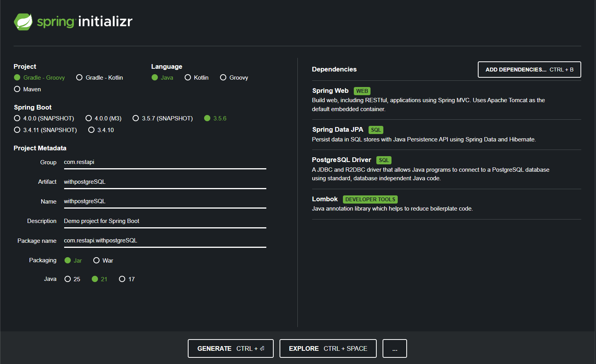
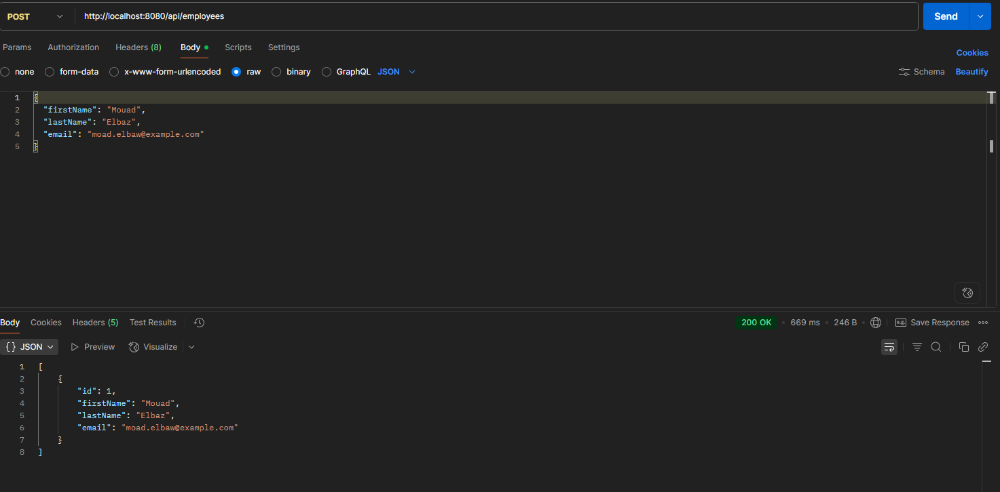

# Spring Boot + PostgreSQL Setup Guide (Java 21)

This guide helps developers quickly set up a Spring Boot application with PostgreSQL, create schemas, tables, insert sample data, and test APIs using Postman — fully compatible with **Java 21**.

---

## 📂 Getting Started

- Spring Initializr project:  
  

- Postman collection:  
  

---

## 🎯 Objective

Set up a Spring Boot + PostgreSQL project where:

- Database is reset on each restart
- Sample data is automatically inserted
- APIs are testable via Postman

---

## 1️⃣ Prerequisites

- Java 21 installed  
- PostgreSQL installed (or via Docker)  
- Maven or Gradle installed  
- IDE (IntelliJ IDEA, VSCode, Eclipse)  
- Postman for API testing  

---

## 2️⃣ Spring Boot Project Setup

1. Open [Spring Initializr](https://start.spring.io/)  
2. Configure project:

| Option     | Value        |
|------------|-------------|
| Project    | Maven / Gradle |
| Language   | Java        |
| Spring Boot| 3.5.x       |
| Packaging  | Jar         |
| Java       | 21          |

3. Add Dependencies:

- Spring Web  
- Spring Data JPA  
- PostgreSQL Driver  

4. Generate project and open it in your IDE.  

> Optional: Add your project ZIP: `/public/SpringInitializer.zip`

---

## 3️⃣ PostgreSQL Setup

### a) Create Database

```sql
-- Connect to postgres as superuser
psql -U postgres

-- Create database
CREATE DATABASE springboot_demo;

-- Create user
CREATE USER demo_user WITH ENCRYPTED PASSWORD 'demo_pass';

-- Grant privileges
GRANT ALL PRIVILEGES ON DATABASE springboot_demo TO demo_user;

b) Create Schema

-- Connect to the database
\c springboot_demo

-- Create schema for the project
CREATE SCHEMA IF NOT EXISTS springboot_schema AUTHORIZATION demo_user;

-- Verify schemas
\dn

4️⃣ Spring Boot Configuration
application.properties
spring.application.name=withpostgreSQL

# PostgreSQL Configuration
spring.datasource.url=jdbc:postgresql://localhost:5432/springboot_demo
spring.datasource.username=demo_user
spring.datasource.password=demo_pass
spring.datasource.driver-class-name=org.postgresql.Driver

# Hibernate Configuration
spring.jpa.hibernate.ddl-auto=create-drop
spring.jpa.properties.hibernate.dialect=org.hibernate.dialect.PostgreSQLDialect
spring.jpa.properties.hibernate.default_schema=springboot_schema

5️⃣ Create Entity
import jakarta.persistence.*;
import lombok.*;

@Entity
@Data
@NoArgsConstructor
@AllArgsConstructor
@Table(name = "employees", schema = "springboot_schema")
public class Employee {

    @Id
    @GeneratedValue(strategy = GenerationType.IDENTITY)
    private Long id;

    private String firstName;
    private String lastName;
    private String email;
}

6️⃣ Running the Application

Run the main class WithpostgreSqlApplication.java

Gradle
./gradlew bootRun

Maven
mvn spring-boot:run

7️⃣ Test API with Postman
GET All Employees
GET http://localhost:8080/api/employees

POST New Employee
{
  "firstName": "Mouad",
  "lastName": "Elbaz",
  "email": "moad.elbaw@example.com"
}


Optional: Add Postman collection ZIP: /public/postman.zip


8️⃣ Notes & Tips

Database is reset on every restart due to spring.jpa.hibernate.ddl-auto=create-drop.

spring.jpa.defer-datasource-initialization=true ensures data.sql runs after tables are created.

Make sure your schema exists and matches hibernate.default_schema.

If data.sql does not run, check placement in src/main/resources/.

Check database tables via:

\c springboot_demo
SELECT * FROM springboot_schema.employees;
